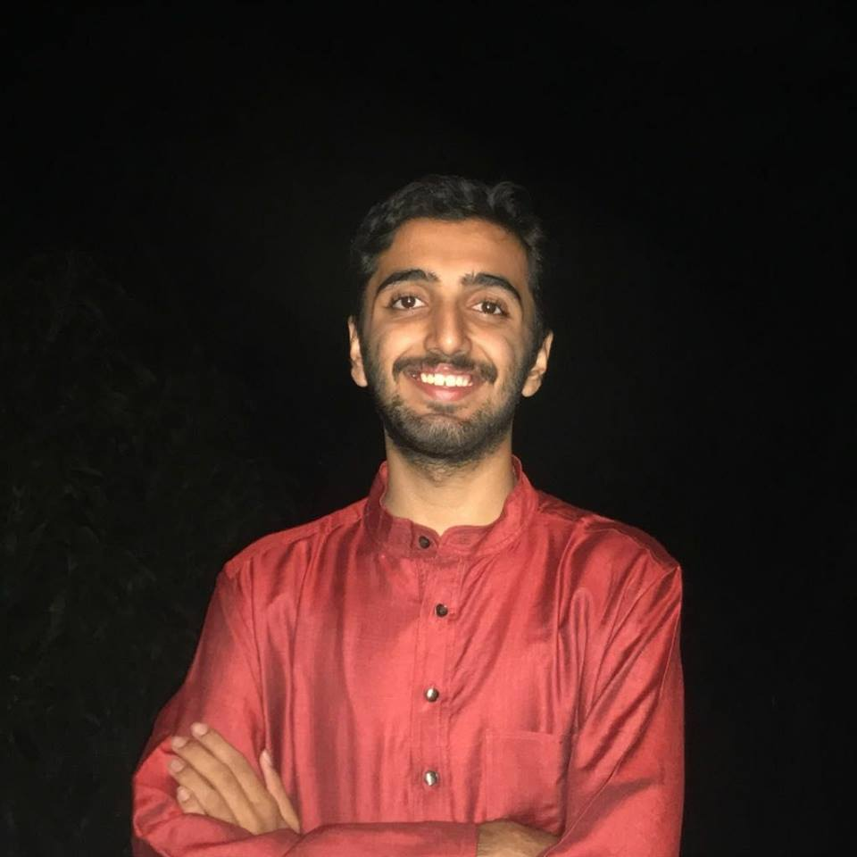

{:style="float: right;margin-right: 7px;margin-top: 7px;height: 200px;border: 5"}
I am currently a junior undergraduate student in the [Department of Computer Science](https://www.cse.iitb.ac.in/) at the [Indian Institute of Technology, Bombay](http://www.iitb.ac.in/). I am part of the Computational Speech and Language Technologies Lab ([CSALT](https://www.cse.iitb.ac.in/~pjyothi/csalt/)) and am fortunate to be advised by [Prof. Preethi Jyothi](https://www.cse.iitb.ac.in/~pjyothi/). 

My primary research interests lie in Machine Learning and Natural Language Processing. Check out the [Research](https://joshinh.github.io/research) tab to know more!

I visited University of North Carolina, Chapel Hill in Summer 2018 and was fortunate to be advised by [Prof. Mohit Bansal](http://www.cs.unc.edu/~mbansal/).

