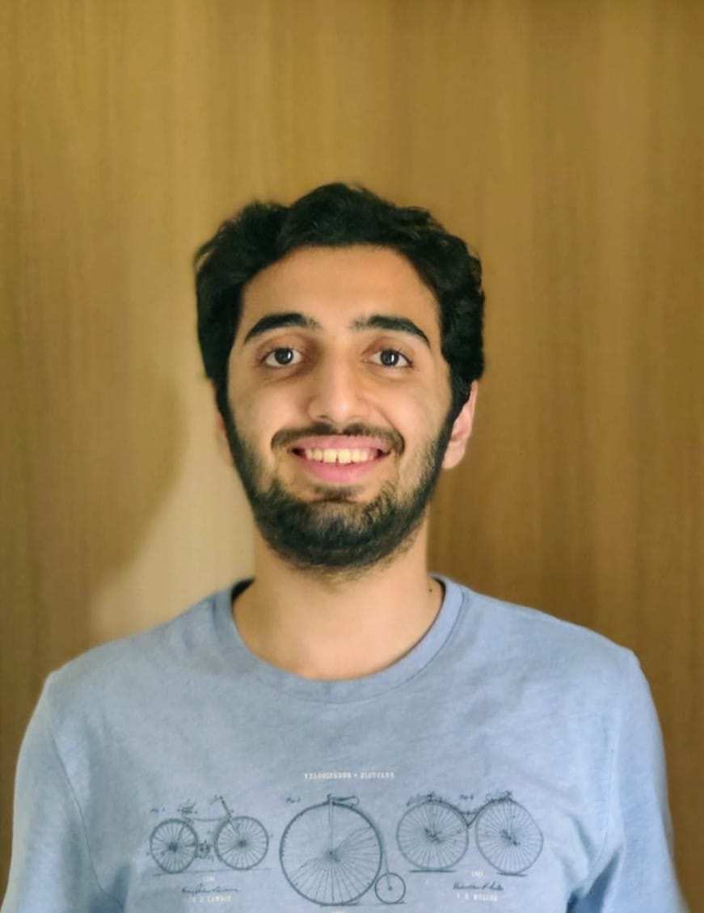

{:style="float: right;margin-right: 7px;margin-top: 7px;margin-left: 7px;height: 250px;border: 5"}
I am currently a senior undergraduate student in the [Department of Computer Science](https://www.cse.iitb.ac.in/) at the [Indian Institute of Technology, Bombay](http://www.iitb.ac.in/). I am part of the Computational Speech and Language Technologies Lab ([CSALT](https://www.cse.iitb.ac.in/~pjyothi/csalt/)) and am fortunate to be advised by [Prof. Preethi Jyothi](https://www.cse.iitb.ac.in/~pjyothi/). 

My primary research interests lie in Machine Learning and Natural Language Processing. Check out the [Research](https://joshinh.github.io/research) tab to know more!

I visited University of North Carolina, Chapel Hill in Summer 2018 and was fortunate to be advised by [Prof. Mohit Bansal](http://www.cs.unc.edu/~mbansal/). I interned at [NEC Labs](http://www.nec-labs.com), Princeton in Summer 2019.

### Updates

- **Jan 2020** Paper on Accent Adaptation for Speech Recognition accepted at ICASSP 2020. Paper link to be out very soon!
- **July 2019** Presented two long papers (oral) on [Multi-Hop Reading Comprehension](https://arxiv.org/pdf/1906.05210.pdf) and [Cross-Lingual Question Generation](https://arxiv.org/pdf/1906.02525.pdf) at ACL 2019 in Florence, Italy
- **May 2019** Internship at [NEC Labs](http://www.nec-labs.com), Princeton
- **May 2018** Internship at [UNC-NLP](http://nlp.cs.unc.edu) Research Lab working with [Prof. Mohit Bansal](http://www.cs.unc.edu/~mbansal/)
- **Dec 2017** Joined [CSALT](https://www.cse.iitb.ac.in/~pjyothi/csalt/) Lab, IIT Bombay conducting research on machine learning and its applications in NLP
- **Aug 2017** Received the Institute Academic Award for academic excellence at IIT Bombay
